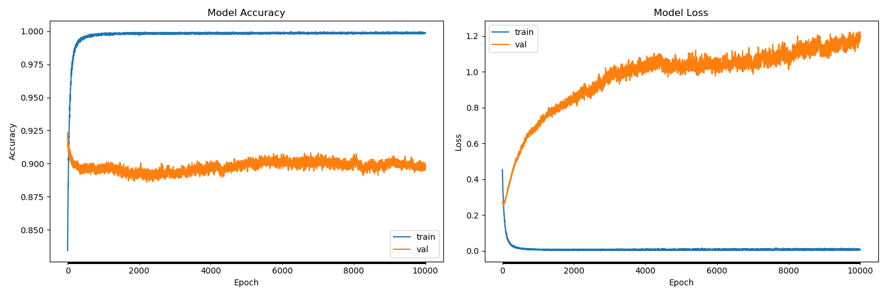
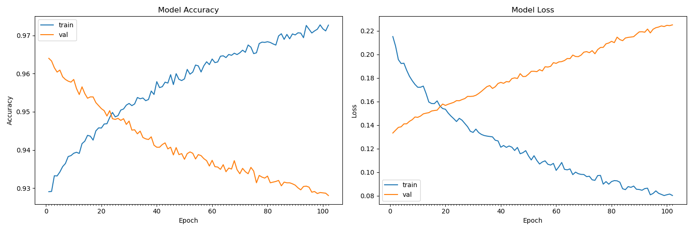
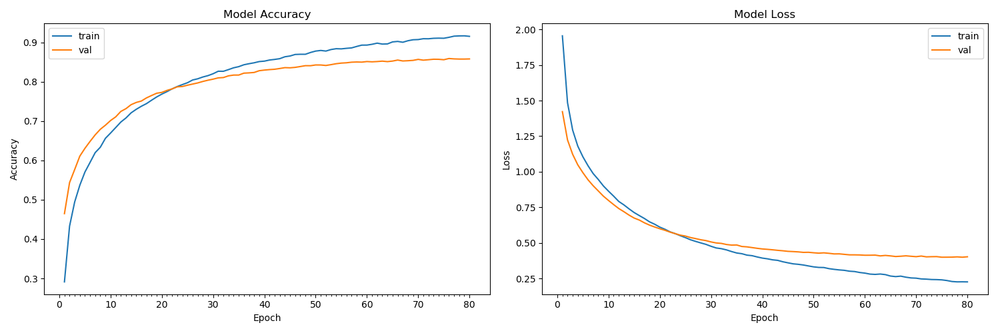
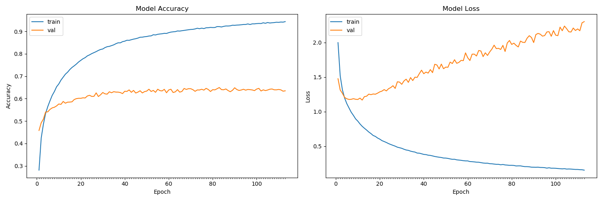
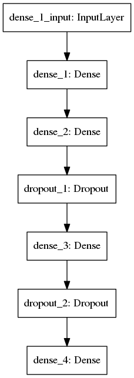

# myo-armband-nn
Gesture recognition using [myo armband](https://www.myo.com) via neural network (keras library & tensorflow backend).


## Requirement
**Library** | **Version**
--- | ---
**Python** | **^3.5.2**
**Keras** | **^2.1.5**
**Tensorflow** | **^1.1.0** 
**Numpy** | **^1.14.1**
**sklearn** |  **^0.19.1**
**Cuda** | **^7.5**
**[myo-python](https://github.com/NiklasRosenstein/myo-python)** |  **^0.2.2**


## Collecting data
We use our own python for collecting EMG data from Myo armband.
And we need to push 64-value array with data from each sensor.<br />
By default myo-python returns 8-value array from each sensors.
Each sensor presented by 2-value array from each sensor: ```[datetime, [EMG DATA]]```.<br />
And sensor will collect a feature from each four times. That's the reason why we need 64-value array.
Dataset contains only 6 gestures:
```
  - Relax (0)
👍 - Ok    (1)
✊️ - Fist  (2)
✌️ - Like  (3)
🤘 - Rock  (4)
🖖 - Spock (5)
```

## Training network

```sh
python3 train.py
```

### Model summary

```
Input Shape(64,)
_________________________________________________________________
Layer (type)                 Output Shape              Param #   
=================================================================
dense_1 (Dense)              (None, 128)               8320      
_________________________________________________________________
dense_2 (Dense)              (None, 256)               33024     
_________________________________________________________________
dropout_1 (Dropout)          (None, 256)               0         
_________________________________________________________________
dense_3 (Dense)              (None, 512)               131584    
_________________________________________________________________
dropout_2 (Dropout)          (None, 512)               0         
_________________________________________________________________
dense_4 (Dense)              (None, 6)                 3078      
=================================================================
Total params: 176,006.0
Trainable params: 176,006.0
Non-trainable params: 0.0
_________________________________________________________________
```
#### Train on a person (80% training data & 20% testing data)

Train on 15658 samples, validate on 3915 samples

10k iteration take about 37 min using LSU LONI HPC. 

```
Epoch 1/10000
  300/15658 [..............................] - ETA: 18s - loss: 0.3991 - acc: 0.8267
 3900/15658 [======>.......................] - ETA: 1s - loss: 0.4414 - acc: 0.8362
 7800/15658 [=============>................] - ETA: 0s - loss: 0.4413 - acc: 0.8356
11700/15658 [=====================>........] - ETA: 0s - loss: 0.4523 - acc: 0.8341
15600/15658 [============================>.] - ETA: 0s - loss: 0.4539 - acc: 0.8342
15658/15658 [==============================] - 0s - loss: 0.4538 - acc: 0.8343 - val_loss: 0.2659 - val_acc: 0.9236
......
Epoch 10000/10000
  300/15658 [..............................] - ETA: 0s - loss: 0.0011 - acc: 1.0000
 4500/15658 [=======>......................] - ETA: 0s - loss: 0.0053 - acc: 0.9987
 8700/15658 [===============>..............] - ETA: 0s - loss: 0.0063 - acc: 0.9987
12900/15658 [=======================>......] - ETA: 0s - loss: 0.0065 - acc: 0.9988
15658/15658 [==============================] - 0s - loss: 0.0058 - acc: 0.9989 - val_loss: 1.1991 - val_acc: 0.8983
Number of correct predictions: 3517(total:3915)
Accuracy: 89.83%
```

Accuracy (86.43%) Loose (0.16)::



#### Train on 5 team members (80% training data & 20% testing data) (!!!One member's data was incorrect)

Train on 45543 samples, validate on 11386 samples

we added a early stop callback to the training. If 100 of epochs with no improvement on val_loss, the training will stop
So even we set 10k iteration, it actually stopped at 102 epoch.
This training took 1 min using LSU LONI HPC. And the accuracy of prediction on test data set was 92.81%

```
Epoch 1/10000
45543/45543 [==============================] - 1s - loss: 0.2151 - acc: 0.9291 - val_loss: 0.1332 - val_acc: 0.9640
Epoch 2/10000
45543/45543 [==============================] - 0s - loss: 0.2069 - acc: 0.9291 - val_loss: 0.1356 - val_acc: 0.9633
Epoch 3/10000
45543/45543 [==============================] - 0s - loss: 0.1955 - acc: 0.9332 - val_loss: 0.1380 - val_acc: 0.9615
......
Epoch 102/10000
45543/45543 [==============================] - 0s - loss: 0.0802 - acc: 0.9727 - val_loss: 0.2250 - val_acc: 0.9281

Number of correct predictions: 10567(total:11386)
Accuracy: 92.81%
```

Accuracy (92.81%) Loose (0.08)::



#### Train on 5 team members (80% training data & 20% testing data) (Fix the problem above)

Train on 45691 samples, validate on 11423 samples

```
Evaluate on test, accuracy: 94.04%

Number of correct predictions: 10742(total:11423)

Relax Fist Roll Hold Drag Rock     
 2244    0    3   13    2    4 (0)Relax
    0 1764   24    1   41   52 (1)Fist
    2   29 1530  147   27    6 (2)Roll
   21    1   42 1759   40    6 (3)Hold
    1   14   35   77 1646   26 (4)Drag
    2   27    4    9   25 1799 (5)Rock
Predict Accuracy: 94.04%
```




#### Train on 4 team members (80% training data & 20% testing data) Then use the 5th member's data to test

Train on 46030 samples, validate on 11084 samples

we added a early stop callback to the training. If 20 of epochs with no improvement on val_loss, the training will stop
So even we set 10k iteration, it actually stopped at 102 epoch.
This training took 1 min using LSU LONI HPC. And the accuracy of prediction on test data set was 86.43%

```
Epoch 1/10000
46030/46030 [==============================] - 1s - loss: 1.9980 - acc: 0.2811 - val_loss: 1.4762 - val_acc: 0.4580
Epoch 2/10000
46030/46030 [==============================] - 0s - loss: 1.5169 - acc: 0.4239 - val_loss: 1.3125 - val_acc: 0.4922
Epoch 3/10000
46030/46030 [==============================] - 0s - loss: 1.3163 - acc: 0.4862 - val_loss: 1.2652 - val_acc: 0.5087
......
Epoch 111/10000
46030/46030 [==============================] - 0s - loss: 0.1610 - acc: 0.9418 - val_loss: 2.1698 - val_acc: 0.6393
Epoch 112/10000
46030/46030 [==============================] - 0s - loss: 0.1603 - acc: 0.9413 - val_loss: 2.2844 - val_acc: 0.6333
Epoch 113/10000
46030/46030 [==============================] - 0s - loss: 0.1544 - acc: 0.9436 - val_loss: 2.3013 - val_acc: 0.6349

Evaluate on test, accuracy: 63.49%

Number of correct predictions: 7037

Relax Fist Roll Hold Drag Rock     
 1881    0    0    4    0    0 (0)Relax
    0 1588    0    0   16  206 (1)Fist
    2 1409  219   83    6  100 (2)Roll
  626    0   83  913  256    5 (3)Hold
    2  688   15   24  778  340 (4)Drag
    1   37   16   39   89 1658 (5)Rock

Predict Accuracy: 63.49%


```

Predict accuracy (63.49%) Loose (0.15)::




## Prediction
### Prediction on data from MYO armband
```sh
python3 predict.py
```
You must have installed MYO SDK.
Script will return number (0-5) witch represent gesture (0 - relaxed arm).

## Plot

```sh
python3 plot.py
```




## License
[GNU General Public License v3.0](https://github.com/exelban/myo-armband-nn/blob/master/LICENSE)
